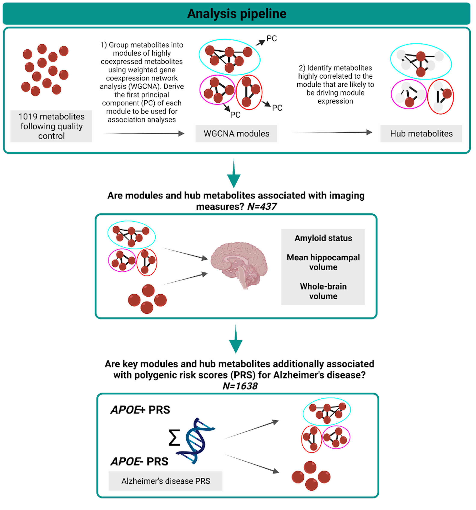

## **Investigating associations between blood metabolites, later life brain imaging measures, and genetic risk for Alzheimer’s disease**

[https://doi.org/10.1101/2022.01.29.22270098](https://doi.org/10.1101/2022.01.29.22270098)

_Rebecca E. Green, Jodie Lord, Marzia A. Scelsi, Jin Xu, Andrew Wong, Sarah Naomi-James, Alex Handy, Lachlan Gilchrist, Dylan M. Williams, Thomas D. Parker, Christopher A. Lane, Ian B. Malone, David M. Cash, Carole H. Sudre, William Coath, David L. Thomas, Sarah Keuss, Richard Dobson, Cristina Legido-Quigley, Nick C. Fox, Jonathan M. Schott, Marcus Richards, Petroula Proitsi, The Insight 46 study team_

---

### Background

This repo contains analysis code for the paper [**Investigating associations between blood metabolites, later life brain imaging measures, and genetic risk for Alzheimer’s disease**](https://doi.org/10.1101/2022.01.29.22270098) - _Green et al_ 2023. This work is published in _Alzheimer's Research and Therapy_.

#### Repo structure:

```
├── README.md
├── LICENSE.md
├── 0.prev_analysis-WGCNA_ORA.R 
├── 1.insight_met_analyses.R
├── 2.format_met_results.R
├── 3.base_qc.R
├── 4.prep_target_qc.R
├── 5.target_qc.sh
├── 6.derive_pgs.sh
├── 7.pgs_analyses.R
├── 8.figure2.R
├── 9.figure3.R
├── Figure1.png - analysis workflow figure
```

--- 

### Project workflow

  
---

### Abstract
**Background**
Identifying blood-based signatures of brain health and preclinical pathology may offer insights into early disease mechanisms and highlight avenues for intervention. Here, we systematically profiled associations between blood metabolites and whole-brain volume, hippocampal volume, and amyloid-β status among participants of Insight 46 – the neuroscience sub-study of the National Survey of Health and Development (NSHD). We additionally explored whether key metabolites were associated with polygenic risk for Alzheimer’s disease (AD). 

**Methods**
Following quality control, levels of 1019 metabolites – detected with liquid chromatography-mass spectrometry – were available for 1740 participants at age 60-64. Metabolite data were subsequently clustered into modules of co-expressed metabolites using weighted coexpression network analysis. Accompanying MRI and amyloid-PET imaging data were present for 437 participants (age 69-71). Regression analyses tested relationships between metabolite measures – modules and hub metabolites – and imaging outcomes. Hub metabolites were defined as metabolites that were highly connected within significant (pFDR<0.05) modules, or were identified as a hub in a previous analysis on cognitive function in the same cohort. Regression models included adjustments for age, sex, APOE genotype, lipid medication use, childhood cognitive ability and social factors. Finally, associations were tested between AD polygenic risk scores (PRS), including and excluding the APOE region, and metabolites and modules that significantly associated (pFDR<0.05) with an imaging outcome (N=1638). 

**Results**
In the fully adjusted model, three lipid modules were associated with a brain volume measure (pFDR<0.05): one enriched in sphingolipids (hippocampal volume: ß=0.14, 95%CI=[0.055,0.23]), one in several fatty acid pathways (whole-brain volume: ß=-0.072, 95%CI=[-0.12,-0.026]), and another in diacylglycerols and phosphatidylethanolamines (whole-brain volume: ß=-0.066, 95%CI=[-0.11,-0.020]). Twenty-two hub metabolites were associated (pFDR<0.05) with an imaging outcome (whole-brain volume: 22; hippocampal volume: 4). Some nominal associations were reported for amyloid-β, and with an AD PRS in our genetic analysis, but none survived multiple testing correction. 

**Conclusions**
Our findings highlight key metabolites, with functions in membrane integrity and cell signalling, that associated with structural brain measures in later life. Future research should focus on replicating this work and interrogating causality. 
